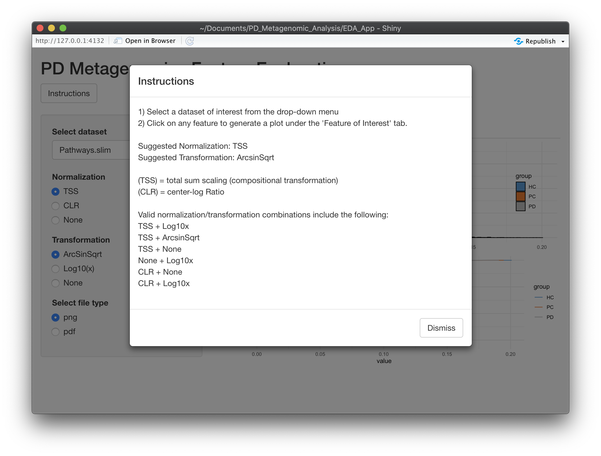
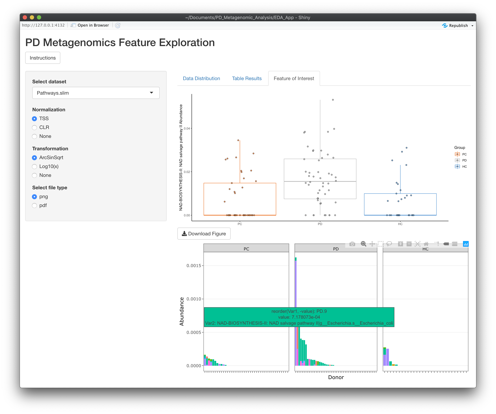

# Metagenomic Analysis of the Parkinson's Disease Microbiome (Under Construction)
### This repository recreates the shotgun metagenomic analysis presented in : paper link

***

##### Badges will go here

## Table of Contents
1. [Background](#Background)
1. [Requirements]("#Requirements")
1. [Workflow](#Workflow)
1. [Setup/Installation](#Set-up/Installation)
1. [Exploratory Data Visualization](#Exploratory-Data-Visualization)
1. [Metadata Explained Variance](#Metadata-Explained-Variance)
1. [Community Composition](#Community-Composition)
1. [Multivariate Statistical Linear Models](#Multivariate-Statistical-Linear-Models)
1. [Dirichlet Multinomial Mixtures](#Dirichlet-Multinomial-Mixtures)
1. [Probabilistic Graphical Models](#Probabilistic-Graphical-Models)
1. [Gut Metabolic and Gut Brain Modules GMMs GBMs](#Gut-Metabolic-and-Gut-Brain-Modules-GMMs-GBMs)
1. [Virulence Analysis](#Virulence-Analysis)
1. [Microbial Amyloid Quantification](#Microbial-Amyloid-Quantification)
1. [Biomarker Selection and Validation](#Biomarker-Selection-and-Validation)
1. [Feature Specificity for Parkinson's Disease](#PD-Feature-Specificity)

## Background
--

## Requirements
All software used for this analysis is open source and freely available to the public. 
The majority of this analysis takes place in R-studio. Certain packages require R version >= 3.6. 
We recommend updating to __R 4.0.1. - "See Things Now"__ for this analysis.

1. Download [R](https://www.r-project.org/) 
2. Download [R-studio](https://rstudio.com/products/rstudio/download/)

In addition, the FlashWeave Probablistic Graphical Models utilze Julia, Python, JupyterNotebook, 
follow the intructions below to download the necessary packages:

1. Download [python](https://www.python.org/downloads/)
1. Download [numpy](https://numpy.org/install/)
1. Download [networkx](https://networkx.github.io/documentation/stable/install.html)
1. Download [matplotlib](https://matplotlib.org/3.2.2/users/installing.html)
2. Download [JupyterNotebook](https://jupyter.org/install)
3. Download [Julia](https://julialang.org/) (see below)

Download the binary version from https://julialang.org/downloads/. Julia 1.0 or above are currently supported by FlashWeave.

> To call julia from the command line, update your .bash_profile with the following __BUT__ replace quoted section with your own download location/version:

`PATH="/Applications/Julia-1.4.app/Contents/Resources/julia/bin/:${PATH}"
export PATH`

> This line sources your .bashrc file (also add to .bash_profile)

`if [ -f $HOME/.bashrc ]; then
    . $HOME/.bashrc
fi`

## Workflow:
Run the following analyses in the specified order. The scripts are located in the source (src) file and the outputs of will be generated in the __data/__ and __figures/__ folders.
R-scripts may be run by opening each individually in R-studio, selecting all, and using (command + enter) or by the command line by typing the following:

`Rscript name_of_rscript.R`

Various Object Types names and descriptions

| Phyloseq Objects          | Feature Abundance           |
| ------------------------- |:--------------------------  |
| dat                       | Species                     |
| dat.genus                 | Genus                       |
| dat.phylum                | Phylum                      |
| dat.pathways              | Pathways (Stratified)       |
| dat.pathways.slim         | Pathways                    |
| dat.ecs                   | Enzmyes (Stratified)        |
| dat.ecs.slim              | Enzmyes                     |
| dat.KOs                   | Kegg Orthologs (Stratified) |
| dat.KOs.slim              | Kegg Orthologs              |
| dat.Pfams                 | Pfams (Stratified)          |
| dat.Pfams.slim            | Pfams                       |
| dat.Eggnogs               | EggNogs (Stratified)        |
| dat.Eggnogs.slim          | EggNogs                     |

### Setup/Installation: 
 Load all necessary packages for analysis. If any errors present themselves make sure you are using the proper version of R (4.0.1. - "See Things Now").
  * Run: __configure.enviornment.R__ 
  
To collate data tables into phlyoseq objects that are used downstream. 
  * Run:__create_phyloseq_obj.R__ 

### Exploratory-Data-Visualization
A Shiny Web Application is made available to explore features of interest within this dataset. To use this application open the __app.R__ script and run using the green arrow in the top right-hand corner of R-studio.

### Metadata-Explained-Variance
This analysis sources PERMANOVA_Analysis.R which may take a few minutes to complete with permutations = 9,999.

  * Run: __PERMANOVA_Viz.R__

### Community-Composition
Run the following:
  * __community_composition_overview.R__ 

### Multivariate-Statistical-Linear-Models
To test for associations between our PD donors and the two controls groups we utilized [MaAsLin2](https://github.com/biobakery/Maaslin2) and employed general linear models accounting for age, sex, and bmi in one comparison between PD patients (n=48) and Healthy Population Controls (n=41), and a separate model for PD Patients and Spouse Controls (n=29 each) which accounts for the household effect. 

Data generated by this analysis is used in multiple scripts downstream. Conducting this analysis will take approximately one hour (longer if no low variance trimming is selected) due to the large amount of features present in the enzyme and KO datasets along with mutliple models accounting for stratification.

Run the following scripts:

  * __MaAsLin2_Analysis.R__

To vizualize data generated from these models:

Run:
  * __dafs.R__

Note that this script requires some manual input: To visualize a particular dataset of interest - replace name of Robj in section of script titled (SWAP FUNCTION LEVEL HERE) (see table above for options) 

### Dirichlet-Multinomial-Mixtures
  * Run: __DMM_Analysis.R__

### Probabilistic-Graphical-Models
This analysis requires multiple platforms, run the following script in Rstudio to prep the necessary input tables and metadata for 
[FlashWeave](#https://github.com/meringlab/FlashWeave.jl.git) analysis and vizualization. Flashweave analysis takes place at the command-line,
while vizualization uses D3.js within a Jupyter notebook.

  * Run: __FlashWeave_input_prep.R__

(WARNING: This analysis may take up to (3-4) hours)
Next, open a terminal console and navigate to the directory with this repository. Run the FlashWeave Analysis with the following line:

`julia correlation_analysis.jl`

To build the interactive network open Jupyter Notebook (type `Jupter Notebook` in terminal console). Go to the __Help__ Tab and select : __Launch Classic Notebook__. Navigate to D3.js_Network_viz.ipynb file and enter (Cell -> Run All)

### Gut-Metabolic-and-Gut-Brain-Modules-GMMs-GBMs
  * Run: __omixer-rmpR_setup.R__
  
### Virulence-Analysis
  * Run: __Virulence_Analysis.R__

### Microbial-Amyloid-Quantification
  * Run: __Amyloidgenic_Protein_Analysis.R__

### Biomarker-Selection-and-Validation
  * Run: __Machine_Learning_Model_Comparison_Analysis.R__

### PD-Feature-Specificity
  * Run: __Disease_Specificity.R__

## Acknowledgements

## License
MIT License 2020 jboktor

Any questions contact: jboktor@caltech.edu
